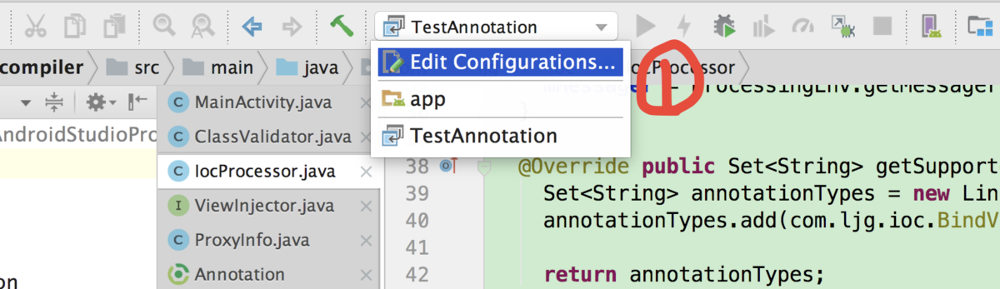
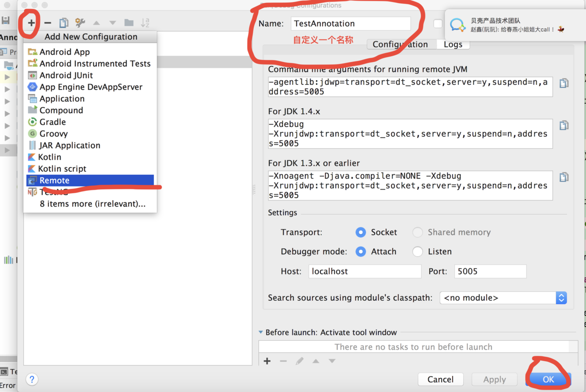
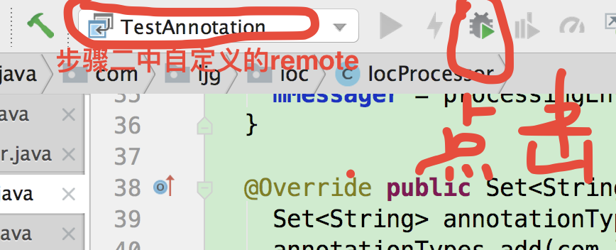

## Android 注解开发断点调试

### 1.Edit Configurations



### 2.创建Remote



### 3.在命令行中执行：

```
./gradlew clean build -Dorg.gradle.daemon=false -Dorg.gradle.debug=true
```

### 4.打断点

在自定义的AbstractProcessor子类中打相应的断点。

### 5.开始运行debug




